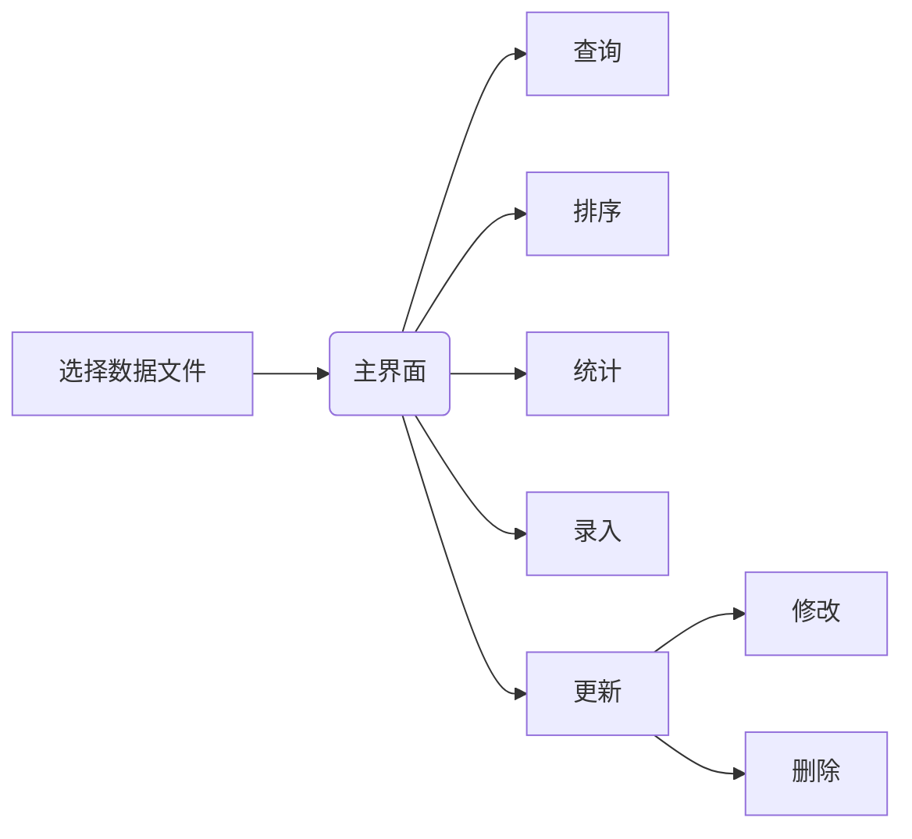

#程序设计：家庭消费记录管理系统  
简介：为提倡合理消费，适度消费，规划消费，培养良好消费习惯，本系统用于记录家庭成员的消费金额，可记录每笔消费金额的消费日期、消费成员、消费品类、支出方式、消费场所、消费详情。

##1.项目结构：

```
.
├── 欢迎界面
│   ├── FDCRMS_UI.h
│   └── FDCRMS_UIDlg.cpp
├── 主界面
│   ├── MainMenuDlg.h
│   └── MainMenuDlg.cpp
├── 功能界面
│   └── 查询
│       ├── SearchDlg.h
│       └── SearchDlg.cpp
│   └── 排序
│       ├── SortDlg.h
│       └── SortDlg.cpp
│   └── 统计总金额
│       ├── SumDlg.h
│       └── SumDlg.cpp
│   └── 录入新数据
│       ├── PropertyDlg.h
│       └── PropertyDlg.cpp
│   └── 更新数据
│       ├── Property_ChgDlg.h
│       ├── Property_ChgDlg.cpp
│       └──修改
│           ├── ChangeDlg.h
│           └── ChangeDlg.cpp
│   └── 进行排序、查询等操作的函数
│       └── func.cpp
├── fdcrms.h
└── IDE自动生成等杂项文件

```

##2.功能简介：
####显示：
    首次进入程序，在主界面显示所有数据信息；进行修改、排序、查询后也会在主界面显示相应数据信息
####查询：
    根据指定消费时间段或具体的消费金额进行查询，可按照家庭成员和消费品类进行筛选
####新增数据：
    输入相应的消费日期、成员身份、支出方式、消费金额、消费场所、消费品类和商品详情，即可新增数据
####统计：
    选择起始日期和截止日期即可统计相应时间段的金额，还可统计指定消费品类和指定家庭成员(在指定时间段的)消费金额
####排序：
    根据消费日期或者消费金额进行升序或降序排序
####更新:
    根据消费日期、成员身份、消费品类查询到唯一的数据，进行修改或删除
####刷新:
    若进行了查询等操作，可以通过刷新获取全部数据
####保存：
    每进行录入、更新操作，本系统可自动保存相应的数据文件(*.dat)


##3.主要工作流程图:

